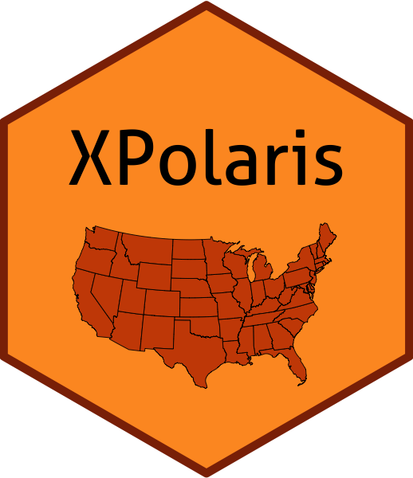

<!-- README.md is generated from README.Rmd. Please edit that file -->

# XPolaris

<!-- badges: start -->

[](https://travis-ci.com/lhmrosso/XPolaris)
[](https://ci.appveyor.com/project/lhmrosso/XPolaris)
[](https://codecov.io/gh/lhmrosso/XPolaris?branch=master)
<!-- badges: end -->



The *XPolaris* package aims to facilitate the access to detailed soil
data at any geographical location within the United States (US). The
[**POLARIS**](http://hydrology.cee.duke.edu/POLARIS/) database comprises
a 30-meter probabilistic soil series map of the contiguous United States
(US). It represents an optimization of the Soil Survey Geographic
(SSURGO) database, circumventing issues of spatial disaggregation,
harmonizing, and filling spatial gaps \[1, 2\]. Without the need of
advanced skills on R-programming, users will be able to convert raster
data into traditional spreadsheet format for further data analyses.

## Installation

You can install the development version from
[GitHub](https://github.com/) with:

``` r
# install.packages("devtools")
devtools::install_github("lhmrosso/XPolaris")
```

## Example

After loading the package, users must create a `data.frame` object
containing three columns (`ID`, `lat`, and `long`). Location IDs must be
unique alphanumerical identifiers, and latitude and longitude
coordinates must be supplied as decimal degrees. The package comes with
example locations in Kansas (`exkansas`).

``` r
library(XPolaris)
print(exkansas)
#>           ID     lat     long
#> 1    Scandia 39.8291 -97.8458
#> 2 Belleville 39.8158 -97.6720
#> 3     Ottawa 38.5398 -95.2446
```

The package is composed by three R functions:  
1) `xplot`: generates a map displaying the rater images from which
locations will be retrieved;  
2) `ximages`: downloads the images from the POLARIS database to the
user’s local machine;  
3) `xsoil`: extracts the soil data from raster images and creates a
`data.frame` object.

``` r
# Plotting image locations (checking images)
# The output is a ggplot object but a jpeg is exported
# Figure is saved in a new folder called (POLARISOut)
# A data.frame with coordinates is the main argument
# Locations must have unique ID codes

xplot(locations = exkansas)

# Downloading POLARIS images (POLARISOut folder)
# Important user inputs (see argument details below)
# Images are stored in the POLARISOut folder (sub-folders)
# This function does not download the same images twice
# Main arguments are either data.frame or vectors
# Vectors should contain character elements

df_ximages <- ximages(locations = exkansas,
                      statistics = c('mean'),
                      variables = c('ph','om','clay'),
                      layersdepths = c('0_5','5_15','15_30'))

# Retrieving raster soil data from images (points)
# The output is a data.frame but a csv file is exported
# ximages output is the main argument to extract soil data

xsoil(ximages_output = df_ximages)
```

### `ximages` arguments

-   `locations` - Locations `data.frame` (`exkansas`);

-   `variables` - Soil variable codes and units from POLARIS:

|      Code | Description                                        | Data unit                              | Output unit                    |
|----------:|:---------------------------------------------------|:---------------------------------------|:-------------------------------|
|      `ph` | Soil pH in water                                   | \-                                     | \-                             |
|      `om` | Soil organic matter                                | log<sub>10</sub>(%)                    | %                              |
|    `clay` | Clay                                               | %                                      | %                              |
|    `sand` | Sand                                               | %                                      | %                              |
|    `silt` | Silt                                               | %                                      | %                              |
|      `bd` | Bulk density                                       | g cm<sup> − 3</sup>                    | g cm<sup> − 3</sup>            |
|      `hb` | Bubbling pressure (Brooks-Corey)                   | log<sub>10</sub>(kPa)                  | kPa                            |
|       `n` | Measure of pore size distribution (van Genuchten)  | \-                                     | \-                             |
|   `alpha` | Scale param. inversely prop. to mean pore diameter | log<sub>10</sub>(kPa<sup> − 1</sup>)   | kPa<sup> − 1</sup>             |
|    `ksat` | Saturated hydraulic conductivity                   | log<sub>10</sub>(cm hr<sup> − 1</sup>) | cm hr<sup> − 1</sup>           |
|  `lambda` | Pore size distribution index (Brooks-Corey)        | \-                                     | \-                             |
| `theta_r` | Residual soil water content                        | m<sup>3</sup> m<sup> − 3</sup>         | m<sup>3</sup> m<sup> − 3</sup> |
| `theta_s` | Saturated soil water content                       | m<sup>3</sup> m<sup> − 3</sup>         | m<sup>3</sup> m<sup> − 3</sup> |

-   `statistics` - Summary: `mean`, `mode`, median (`p50`), five (`p5`)
    and 95 (`p95`) percentiles;

-   `layersdepths` - Depth layers: `0_5`, `5_15`, `15_30`, `30_60`,
    `60_100`, and `100_200` cm;

-   `localPath` - Path in the user’s machine to store the images. The
    default is `tempdir()`.

## References

1.  Chaney NW, Wood EF, McBratney AB, Hempel JW, Nauman TW, Brungard CW,
    et al. POLARIS: A 30-meter probabilistic soil series map of the
    contiguous united states. Geoderma. 2016;274:54–67.
    <https://doi.org/10.1016/j.geoderma.2016.03.025>.

2.  Chaney NW, Minasny B, Herman JD, Nauman TW, Brungard CW, Morgan CLS,
    et al. POLARIS soil properties: 30-m probabilistic maps of soil
    properties over the contiguous united states. Water Resources
    Research. 2019;55:2916–38. <https://doi.org/10.1029/2018WR022797>.
